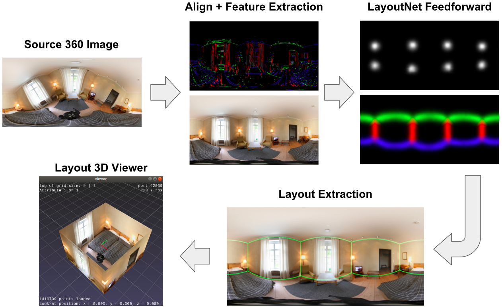
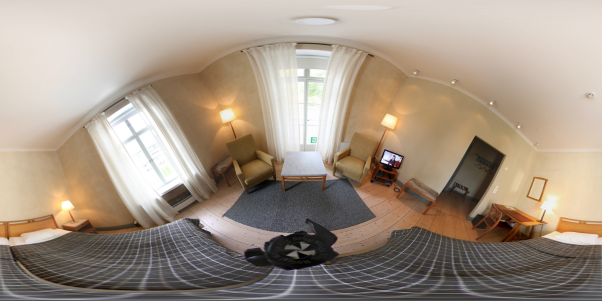
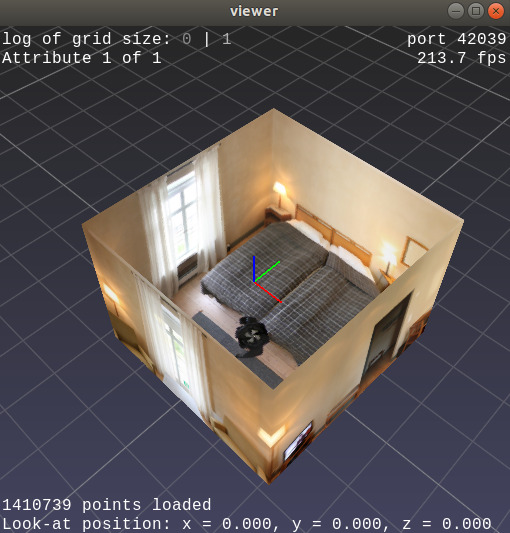

# pytorch-layoutnet

**News: Check out my new project [HorizonNet](https://github.com/sunset1995/HorizonNet) on this task**

This is an unofficial implementation of CVPR 18 [paper](https://arxiv.org/abs/1803.08999)  "LayoutNet: Reconstructing the 3D Room Layout from a Single RGB Image". [Official](https://github.com/zouchuhang/LayoutNet) layout dataset are all converted to `.png` and pretrained models are converted to pytorch `state-dict`.  
What difference from official:
- **Architecture**: Only joint *bounday branch* and *corner branch* are implemented as the paper states that "Training with 3D regressor has a small impact".
- **Pre-processing**: Implementation of *line segment detector* and *pano image alignment* are converted from matlab to python in `pano.py` and `pano_lsd_align.py`.
- **Post-processing**: No 3D layout optimization. Alternatively, this repo implement a gradient ascent optimizing the similar loss. (see below for more detail)

Overview of the pipeline:


Use this repo, you can:
- extract/visualize layout of your own 360 images with my trained network
- reproduce official experiments
- train on your own dataset
- quantitative evaluatation (3D IoU, Corner Error, Pixel Error)


## Requirements
- Python 3
- pytorch>=0.4.1
- numpy
- scipy
- Pillow
- torchfile
- opencv-python>=3.1 (for pre-processing)
- open3d (for layout 3D viewer)
- shapely (for layout 3D viewer)


## Visualization

### 1. Preparation
- Get your fasinated 360 room images. I will use `assert/demo.png` for example.
    - 
- Prepare the enviroment to run the python scripts.
- Download the trained model from [here (350M)](https://drive.google.com/file/d/1ZlXc4DLgOrkDLW6kQbCY-wOJ8bw4DYu2/view?usp=sharing). Put the 3 files extracted from the downloaded zip under `ckpt/` folder.
    - So you will get `ckpt/epoch_30_*.pth`

### 2. Pre-processing (Align camera pose with floor)
- Pre-process the above `assert/demo.png` by firing below command. See `python visual_preprocess.py -h` for more detailed script description.
    ```
    python visual_preprocess.py --img_glob assert/demo.png --output_dir assert/output_preprocess/
    ```
- Arguments explanation:
    - `--img_glob` telling the path to your fasinated 360 room image(s).
    - `--output_dir` telling the path to the directory for dumping the results.
    - *Hint*: you can use shell-style wildcards with quote (e.g. "my_fasinated_img_dir/\*png") to process multiple images in one shot.
- Under the given `--output_dir`, you will get results like below and prefix with source image basename.
    - The aligned rgb images `[SOURCE BASENAME]_aligned_rgb.png` and line segments images `[SOURCE BASENAME]_aligned_line.png`
        - `demo_aligned_rgb.png` | `demo_aligned_line.png`
          :--------------------: | :---------------------:
           | 
    - The detected vanishing points `[SOURCE BASENAME]_VP.txt` (Here `demo_VP.txt`)
        ```
        -0.006676 -0.499807 0.866111
        0.000622 0.866128 0.499821
        0.999992 -0.002519 0.003119
        ```

### 3. Layout Prediction with LayoutNet
- Predict the layout from above aligned image and line segments by firing below command.
    ```
    python visual.py --path_prefix ckpt/epoch_30 --img_glob assert/output_preprocess/demo_aligned_rgb.png --line_glob assert/output_preprocess/demo_aligned_line.png --output_dir assert/output
    ```
- Arguments explanation:
    - `--path_prefix` prefix path to the trained model.
    - `--img_glob` path to the VP aligned image.
    - `--line_glob` path to the corresponding line segment image of the VP aligned image.
    - `--output_dir` path to the directory to dump the results.
    - *Hint*: for the two glob, you can use wildcards with quote
    - *Hint*: for better result, you can add `--flip`, `--rotate 0.25 0.5 0.75`, `--post_optimization`
- you will get results like below and prefix with source image basename.
    - The model's output corner/edge probability map `[SOURCE BASENAME]_[cor|edg].png`
        - `demo_aligned_rgb_cor.png` | `demo_aligned_rgb_edg.png`
          :------------------------: | :------------------------:
           | 
    - The extracted layout and all in one image `[SOURCE BASENAME]_[bon|all].png`
        - `demo_aligned_rgb_bon.png` | `demo_aligned_rgb_all.png`
          :------------------------: | :------------------------:
           | 
    - The extracted corners of the layout `[SOURCE BASENAME]_cor_id.txt`
        ```
        104.928192 186.603119
        104.928192 337.168579
        378.994934 177.796646
        378.994934 346.994629
        649.976440 183.446518
        649.976440 340.711731
        898.234619 190.629089
        898.234619 332.616364
        ```

### 4. Layout 3D Viewer
- A pure python script to visualize the predicted layout in 3D using points cloud. Below command will visualize the result store in `assert/`
    ```
    python visual_3d_layout.py --ignore_ceiling --img assert/output_preprocess/demo_aligned_rgb.png --layout  assert/output/demo_aligned_rgb_cor_id.txt
    ```
- Arguements explanationL
    - `--img` path to aligned 360 image
    - `--layout` path to the txt stroing the `cor_id` (predicted or ground truth)
    - `--ignore_ceiling` prevent rendering ceiling
    - for more arguments, see `python visual_3d_layout.py -h`
- 
    - In the window, you can use mouse and scroll to change the viewport


## Preparation for Training
- Download offical [data](https://github.com/zouchuhang/LayoutNet#data) and [pretrained model](https://github.com/zouchuhang/LayoutNet#pretrained-model) as below
```
/pytorch-layoutnet 
  /data
  | /origin
  |   /data  (download and extract from official)
  |   /gt    (download and extract from official)
  /ckpt
    /panofull_*_pretrained.t7  (download and extract from official)
```
- Execute `python torch2pytorch_data.py` to convert `data/origin/**/*` to `data/train`, `data/valid` and `data/test` for pytorch data loader. Under these folder, `img/` contains all raw rgb `.png` while `line/`, `edge/`, `cor/` contain preprocessed Manhattan line segment, ground truth boundary and ground truth corner respectively.
- [optional] Use `torch2pytorch_pretrained_weight.py` to convert official pretrained pano model to `encoder`, `edg_decoder`, `cor_decoder` pytorch `state_dict` (see `python torch2pytorch_pretrained_weight.py -h` for more detailed). examples:
  - to convert layout pretrained only
    ```
    python torch2pytorch_pretrained_weight.py --torch_pretrained ckpt/panofull_joint_box_pretrained.t7 --encoder ckpt/pre_full_encoder.pth --edg_decoder ckpt/pre_full_edg_decoder.pth --cor_decoder ckpt/pre_full_cor_decoder.pth
    ```
  - to convert full pretrained (layout regressor branch  will be ignored)
    ```
    python torch2pytorch_pretrained_weight.py --torch_pretrained ckpt/panofull_joint_box_pretrained.t7 --encoder ckpt/pre_full_encoder.pth --edg_decoder ckpt/pre_full_edg_decoder.pth --cor_decoder ckpt/pre_full_cor_decoder.pth
    ```


## Training
See `python train.py -h` for detailed arguments explanation.  
The default training strategy is the same as official. To launch experiments as official "corner+boundary" setting (`--id` is used to identified the experiment and can be named youself):
```
python train.py --id exp_default
```
To train only using RGB channels as input (no Manhattan line segment):  
```
python train.py --id exp_rgb --input_cat img --input_channels 3
```

## Gradient Ascent Post Optimization
Instead of offical 3D layout optimization with sampling strategy, this repo implement a gradient ascent optimization algorithm to minimize the similar loss of official.  
The process abstract below:
1. greedily extract the cuboid parameter from corner/edge probability map
    - The cuboid are consist of the 6 parameters (`cx`, `cy`, `dx`, `dy`, `theta`, `h`)
    - `corner probability map`   | `edge probability map`
      :------------------------: | :------------------------:
       | 
2. sample points alone the cuboid boundary and project them to equirectangular formatted corner/edge probability map
    - The sample projected points are visualized as green dot
    - 
3. for each projected sample point, getting value by bilinear interpolation from nearest 4 neighbor pixel on the corner/edge probability map
4. all the sampled values are reduced to a single scalar called score
5. compute the gradient for the 6 cuboid parameter to maximize the score
6. Iterative apply gradient ascent (step 2 through 6)

It take less than 2 seconds on CPU and found slightly better result than offical reported. 


## Quantitative Evaluation
See `python eval.py -h` for more detailed arguments explanation. To get the result from my trained network (link above):
```
python eval.py --path_prefix ckpt/epoch_30 --flip --rotate 0.333 0.666
```
To evaluate with gradient ascent post optimization:
```
python eval.py --path_prefix ckpt/epoch_30 --flip --rotate 0.333 0.666 --post_optimization
```

#### Dataset - PanoContext
| exp | 3D IoU(%) | Corner error(%) | Pixel error(%) |
| :-: | :------: | :------: | :--------------: |
| Official best  | `75.12` | `1.02` | `3.18` |
| ours rgb only  | `71.42` | `1.30` | `3.83` |
| ours rgb only <br> w/ gd opt | `72.52` | `1.50` | `3.66` | 
| ours           | `75.11` | `1.04` | `3.16` |
| ours <br> w/ gd opt | **`76.90`** | **`0.93`** | **`2.81`** |

#### Dataset - Stanford 2D-3D
| exp | 3D IoU(%) | Corner error(%) | Pixel error(%) |
| :-: | :------: | :------: | :--------------: |
| Official best  | `77.51` | `0.92` | **`2.42`** |
| ours rgb only  | `70.39` | `1.50` | `4.28` |
| ours rgb only <br> w/ gd opt | `71.90` | `1.35` | `4.25` | 
| ours           | `75.49` | `0.96` | `3.07` |
| ours <br> w/ gd opt | **`78.90`** | **`0.88`** | `2.78` |


## References
- [LayoutNet: Reconstructing the 3D Room Layout from a Single RGB Image](https://arxiv.org/abs/1803.08999)
  - Chuhang Zou, Alex Colburn, Qi Shan, Derek Hoiem
  - CVPR2018
  ```
  @inproceedings{zou2018layoutnet,
    title={LayoutNet: Reconstructing the 3D Room Layout from a Single RGB Image},
    author={Zou, Chuhang and Colburn, Alex and Shan, Qi and Hoiem, Derek},
    booktitle={Proceedings of the IEEE Conference on Computer Vision and Pattern Recognition},
    pages={2051--2059},
    year={2018}
  }
  ```
  - [Official torch implementation](https://github.com/zouchuhang/LayoutNet)
